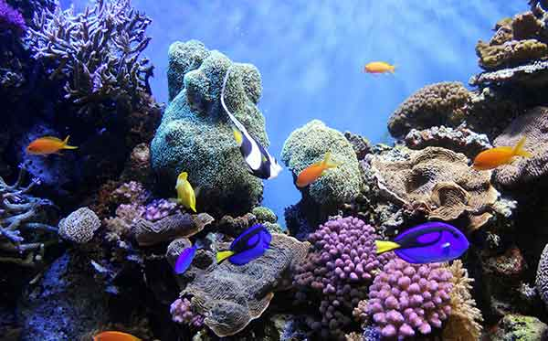
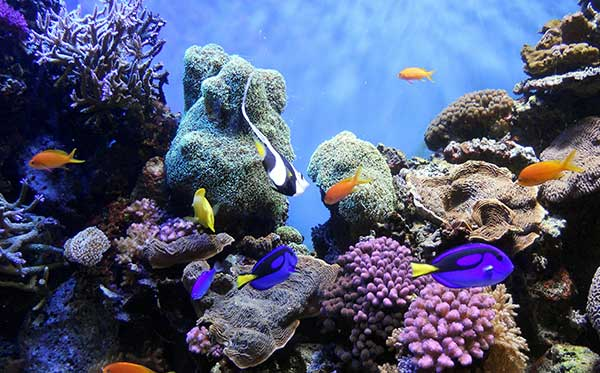
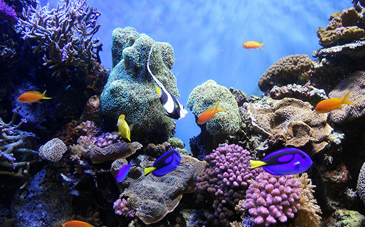

# exercise-4

<!DOCTYPE html>
<html>

<head>
  <meta charset="UTF-8">
  <title>Web Images</title>
</head>

<body>

<h1>Web Images</h1>

Original Image: 1.9MB

Low quality 10(%). File size:32.38K

Medium quality 30(%). File size:51.39K

High quality 60(%). File size:99.32K

Very quality 80(%). File size:166.4K

Maximum quality 100(%). File size:326.K

</body>
</html>
